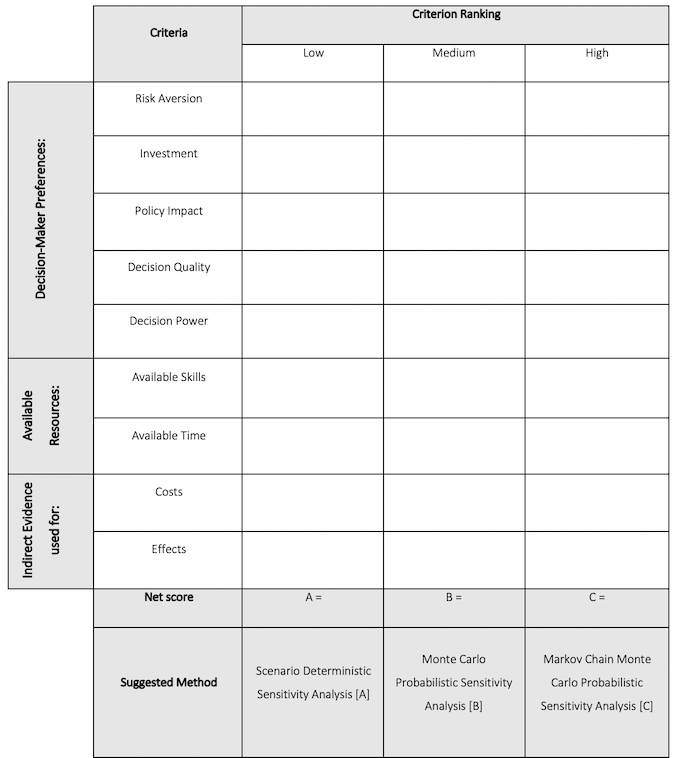

# A Selection Framework for Incorporating a Fully Integrated Bayesian Approach to Cost-Effectiveness Evaluation in Middle Income Country Contexts

 

## Authors
1. [Joshua Soboil](https://orcid.org/0000-0003-1362-8465)a,b
2. [Lucy Cunnama](https://orcid.org/0000-0003-2134-4905)b
3. [Tommy Wilkinson](https://orcid.org/0000-0003-0806-2196)b

a. Corresponding author's [email](mailto:soboil.joshua@gmail.com)  
b. Health Economics Unit, School of Public Health and Family Medicine, University of Cape Town
 

## Brief
This repository stores a Cost-Effectiveness Analysis model coded in the R language. It is a replication of a model originally developed by [Sinanovic E. et al.](https://doi.org/10.1016/j.vaccine.2009.08.004), titled:

>The potential cost-effectiveness of adding a human papillomavirus vaccine to the cervical cancer screening programme in South Africa.

## Background
Due to the scarcity of resources faced by middle-income countries (MICs), it is imperative that economic evaluation methods within such contexts are selected judiciously. Accordingly, the article associated with this repository proposes a selection framework intended to streamline and improve the choice of sensitivity analysis methods for health economic evaluations conducted in MICs.

The framework was established by comparing a MIC cost-effectiveness analysis model of the human papillomavirus (HPV) bivalent vaccine to a recreated version using more comprehensive methods and software. The primary intention of the replication was to establish whether a more comprehensive approach would automatically result in higher quality decision-making. The original study was developed in TreeAge, employed a deterministic approach to sensitivity analysis, and found the intervention to be more costly and more effective (while citing considerable uncertainty surrounding the cost of the vaccine). In contrast, the replication study chose a more integrated approach to decision modelling, using Bayesian ‘Markov Chain Monte Carlo’ (MCMC). The replication exercise indicated that the original model under-estimated decision uncertainty however, given the relatively low costs of the intervention, this was negligible and did not result in any significant change to the overall cost-effectiveness of the intervention. Thus, the authors argue that the original model was sufficient in its quality as well as complexity to answer the decision-problem.

## Discussion
The result of the replication study suggests that the *technical* benefits of more complex methods do not always translate into *practical* benefits. Moreover, because social values play a fundamental role in informing health care resource allocation decisions, it is imperative that the analyst always consider the perspective of the decision-maker. Health economic decision-models are not solely predictive tools, but also communication tools that help the decision-maker in weighing both social and economic consequences of their resource allocation decisions. The authors therefore propose a selection framework using the Pugh-matrix concept selection method. Several categories associated with decision-maker preferences, available resources, as well as the type of evidence and software available are defined as essential to consider when choosing the appropriate sensitivity analysis method within MIC contexts. However, because of its concrete and qualitative nature, the authors anticipate that the selection framework will additionally serve as a beneficial instrument for better knowledge translation between an analyst and decision-maker. See a rough version of the selection matrix below:
 
 

 
 

Technical note

Before running the model, ensure that the local working directory is set to the location of the .Rproj folder saved on your computer. In RStudio, the easiest way to select the local directory path is by pressing Ctrl + Shift + H.

The coding style throughout the model follows the framework proposed by [Alarid-Escudero F. et al.](https://doi.org/10.1007/s40273-019-00837-x) titled:

>A Need for Change! A Coding Framework for Improving Transparency in Decision Modeling. 

 